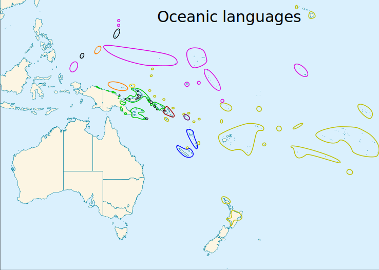
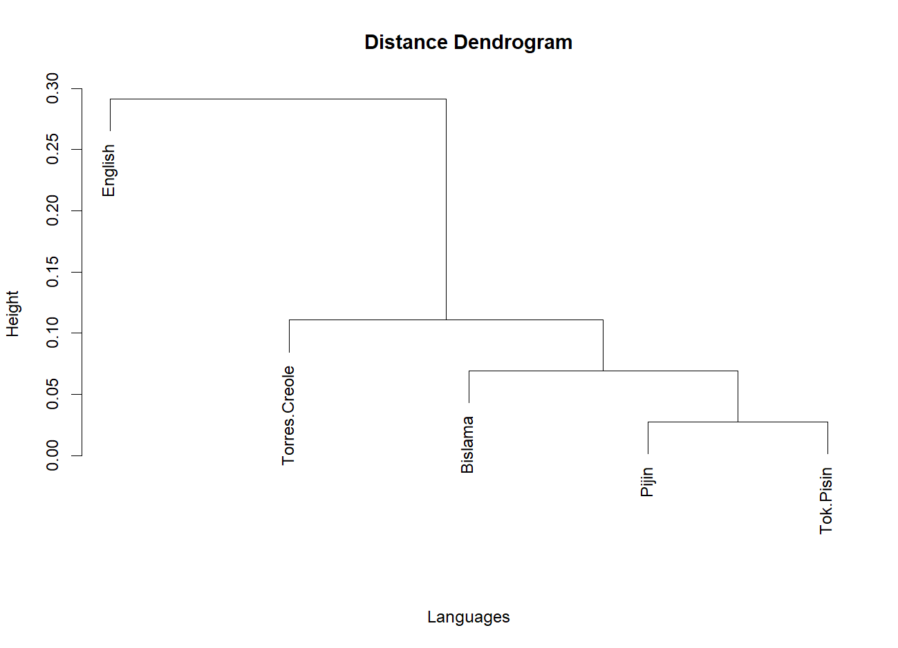

## 🌍 Overview
This project investigates the relationships between creole languages in the oceanic region, namely Tok Pisin, Pijin, Bislama, Torres Creole in comparison to English. The analysis is conducted with phylogenetic methods on basis of both lexical and grammatical features of the languages. 

> By <a href="https://en.wikipedia.org/wiki/User:Kwamikagami" class="extiw" title="wikipedia:User:Kwamikagami">Kwamikagami</a> at <a href="https://en.wikipedia.org/wiki/" class="extiw" title="wikipedia:">English Wikipedia</a>, <a href="https://creativecommons.org/licenses/by-sa/3.0" title="Creative Commons Attribution-Share Alike 3.0">CC BY-SA 3.0</a>, <a href="https://commons.wikimedia.org/w/index.php?curid=5692090">Link</a>

## 📊 Our results
**Tldr**: we mainly found the phylogenetic analysis delivered results that were consistent with the (little) historic records we have about the evolution of these languages. Torres Creole seems to have evolved farther from the Melanesian pidgin branch than the rest of the languages, which stay fairly close in both the lexical and grammatical analysis. 

You can see a simple clusterexample based on Gower distances of the grammatical features here: 

## 📚 Data Sources

| **Sprache**      | **Datensätze**                                                                                                                                                                                                                     |
|------------------|-----------------------------------------------------------------------------------------------------------------------------------------------------------------------------------------------------------------------------------|
| Tok Pisin        | [Grambank](https://grambank.clld.org/languages), [ASJP](https://asjp.clld.org/languages), [Tok Pisin Dictionary](https://en.wikibooks.org/wiki/Tok_Pisin/Dictionary)                                                              |
| Torres Creole    | [Grambank](https://grambank.clld.org/languages), [ASJP](https://asjp.clld.org/languages), [Open Data Portal Queensland Government](https://www.data.qld.gov.au/dataset/slq-aboriginal-languages-word-lists/resource/9229d441-bdcc-40a9-8ad9-d287b2d679c4) |
| Pijin            | [Grambank](https://grambank.clld.org/languages), [ASJP](https://asjp.clld.org/languages), [Blog Post by a native speaker](https://pineapplepost.wordpress.com/2015/08/25/solomon-pijin-sotkats-sms-net-chat-slang-words-and-abbreviations/) |
| Bislama          | [Grambank](https://grambank.clld.org/languages), [ASJP](https://asjp.clld.org/languages), [Bislama.org](https://www.bislama.org/bislama-dictionary)                                                                                |

## ✍️ Authors
Emma Stein & Anton Caesar, University of Göttingen 2024
